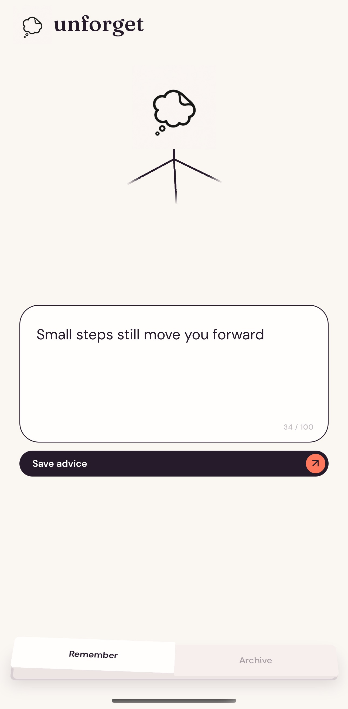
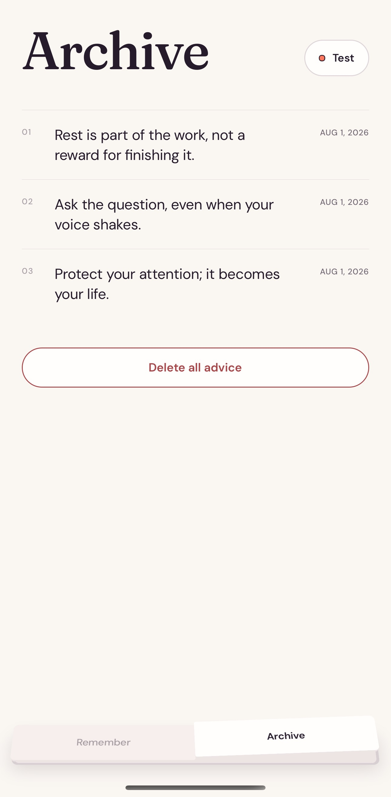
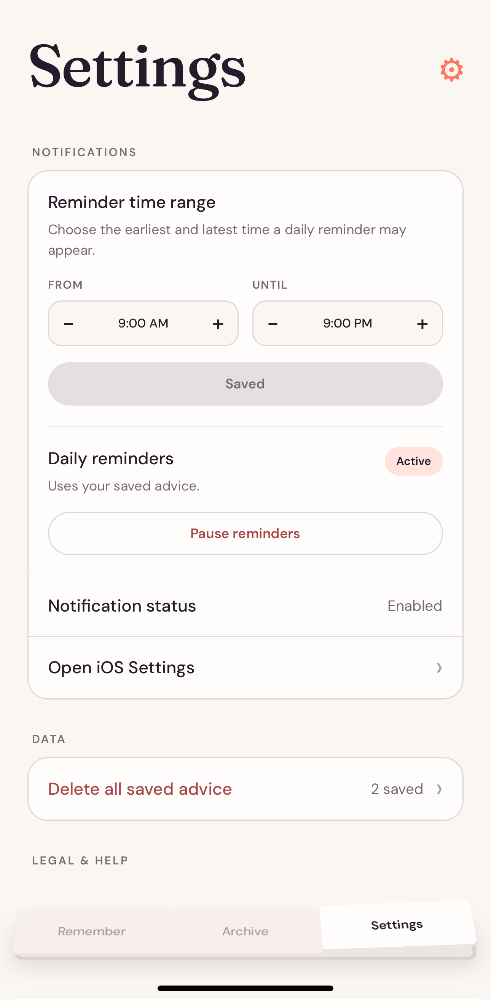

  

<h1 align="center">Unforget</h1>

<em>Remember the advice that changes how you live.</em>

Unforget is a personal advice resurfacing app. It helps people keep hold of the realizations, encouragement, and hard-won wisdom that are easy to lose in the noise of everyday life.

It is not a task manager. There are no projects to organize or checklists to complete. Unforget begins with one simple question:

> What do you want to remember?

A thought such as “Apply before you feel completely ready” becomes part of a private archive and can resurface through a gentle daily notification. The complete message appears in the notification, so the advice arrives in the moment it can matter.

Unforget is designed to feel private, calm, and personal: advice from your past self, delivered when your future self needs it.

## The experience

- Capture a piece of advice, a realization, or a message to your future self.
- Receive a different saved thought through a local daily notification.
- See the complete advice directly in the reminder.
- Test a notification whenever you want.
- Browse, manage, and clear your personal archive.
- Keep everything on your device, without an account or tracking.

## Screenshots

  
  &nbsp;&nbsp;
  
  &nbsp;&nbsp;
  

